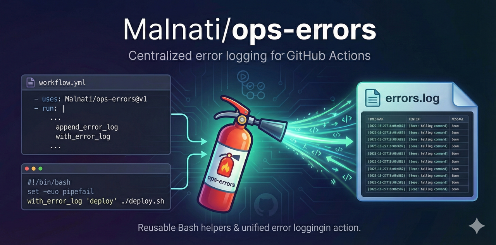

<!-- README.md -->
<h1 align="center">Malnati/ops-errors</h1>

  <b>Centralized error logging for GitHub Actions, with reusable Bash helpers automatically loaded via <code>BASH_ENV</code>.</b>

  

  
  

  
  

<h2>What it does</h2>

  

<ul>
  <li>Creates (or ensures) an error log file on disk.</li>
  <li>Exports <code>ERRORS_PATH</code> to <code>$GITHUB_ENV</code>.</li>
  <li>Exports <code>BASH_ENV</code> so every subsequent <code>shell: bash</code> step automatically loads helper functions.</li>
  <li>Provides helpers like <code>append_error_log</code> and <code>with_error_log</code> to capture stderr and persist it in a single log file.</li>
</ul>

<h2>Why</h2>

  Composite actions often repeat the same <code>append_error_log()</code> function across multiple steps.
  This action eliminates that duplication by shipping a shared Bash library and auto-sourcing it for you.

<h2>Quick start</h2>

  Add this as the <b>first</b> step in your job (or before any step that should log errors):

<pre><code class="language-yaml">- name: "🧯 Setup error logging"
  uses: Malnati/ops-errors@v1.0.0
  with:
    errors_path: .github/workflows/errors.log
</code></pre>

  From this point on, all subsequent <code>shell: bash</code> steps automatically have:

<ul>
  <li><code>ERRORS_PATH</code> available</li>
  <li><code>append_error_log</code> available</li>
  <li><code>with_error_log</code> available</li>
</ul>

<h2>Example usage</h2>

<pre><code class="language-yaml">name: "Example - ops-errors"

on:
  workflow_dispatch:

permissions:
  contents: read

jobs:
  demo:
    runs-on: ubuntu-latest

    steps:
      - uses: actions/checkout@v4

      - name: "🧯 Setup error logging"
        uses: Malnati/ops-errors@v1.0.0
        with:
          errors_path: .github/workflows/errors.log

      - name: "✅ Command with logged stderr (success)"
        shell: bash
        run: |
          set -euo pipefail
          err="$(mktemp)"
          echo "This goes to stderr (but command succeeds)" >&2
          append_error_log "demo: manual stderr capture" "$err" || true

      - name: "❌ Command with logged stderr (failure)"
        shell: bash
        run: |
          set -euo pipefail
          with_error_log "demo: failing command" bash -lc 'echo "Boom" >&2; exit 1'

      - name: "📄 Show the first lines of the error log"
        shell: bash
        run: |
          set -euo pipefail
          echo "ERRORS_PATH=$ERRORS_PATH"
          test -f "$ERRORS_PATH"
          head -n 50 "$ERRORS_PATH" || true
</code></pre>

<h2>Helpers</h2>

<h3><code>append_error_log &lt;context&gt; &lt;stderr_file&gt;</code></h3>
<ul>
  <li>Appends a timestamped section with <code>context</code> and the content of <code>stderr_file</code> into <code>$ERRORS_PATH</code>.</li>
  <li>Safe no-op if <code>ERRORS_PATH</code> is empty or the file is empty.</li>
</ul>

<h3><code>with_error_log &lt;context&gt; &lt;command...&gt;</code></h3>
<ul>
  <li>Runs the command, captures stderr to a temp file, appends to <code>$ERRORS_PATH</code> if it fails, then re-throws the error (exit 1).</li>
  <li>On success, it cleans up and returns 0.</li>
</ul>

<h2>Inputs</h2>

<ul>
  <li><code>errors_path</code> (optional): Path to the error log file. Default: <code>.github/workflows/errors.log</code></li>
</ul>

<h2>Outputs</h2>

<ul>
  <li><code>errors_path</code>: Resolved error log file path.</li>
  <li><code>bash_env</code>: The library file used as <code>BASH_ENV</code>.</li>
</ul>

<h2>Notes</h2>

<ul>
  <li><b>Use <code>shell: bash</code></b> for steps that rely on <code>BASH_ENV</code> auto-loading.</li>
  <li>The error log is appended; you can rotate it in your workflow if desired.</li>
</ul>

  Made for consistent, low-noise, reusable error logging across composite actions and workflows.

